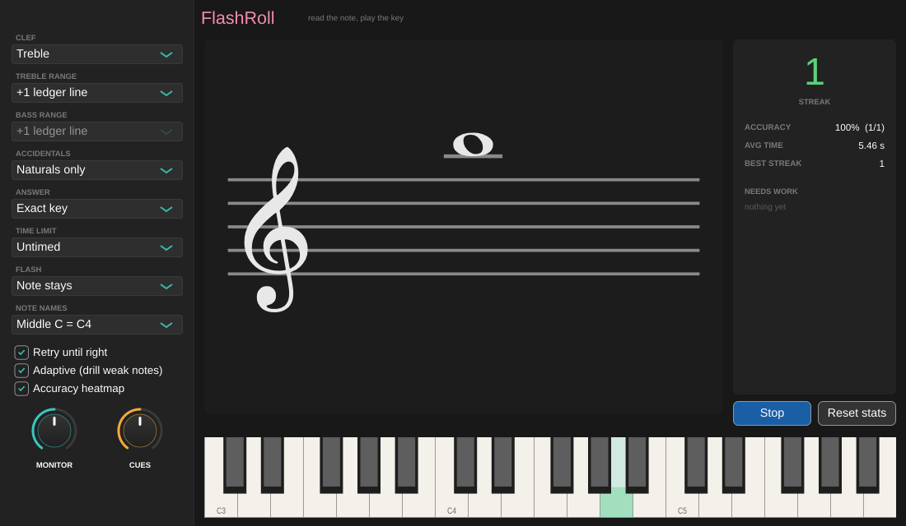
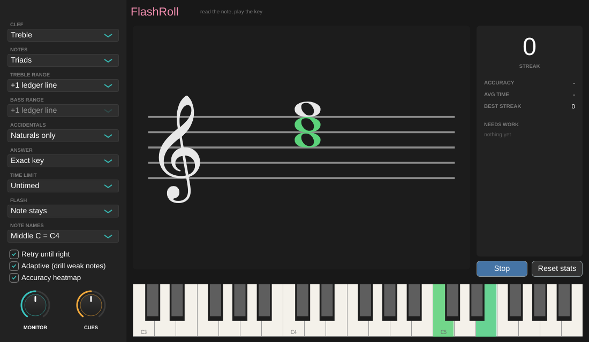

# FlashRoll

**Read the note, play the key.** FlashRoll is a sight-reading trainer built as
an audio plugin (VST3 + Standalone, JUCE 8). It flashes a note on a treble,
bass or grand staff and waits for you to play the matching key on your MIDI
keyboard. It tracks how accurate and how fast you are on every note, and the
notes you miss come up more often.





## What it does

- **Real engraving.** Clefs, whole notes, sharps/flats and ledger lines are
  drawn with the embedded [Bravura](https://github.com/steinbergmedia/bravura)
  SMuFL music font, so they look the same on every machine and nothing needs
  installing.
- **Answer from any MIDI source.** Play your controller or digital piano (the
  host's MIDI), or click the on-screen keyboard. Enharmonics count as correct
  automatically: you answer with a *key*, so C♯ and D♭ are the same answer.
- **Intervals and chords.** Besides single notes you can drill intervals
  (minor second up to the octave), triads (major, minor, diminished,
  augmented) and seventh chords (maj7, 7, m7, ø7, °7). Each one is stacked on
  a single staff and spelled correctly, so a minor third over C is E♭, never
  D♯. Hold all the tones to answer. You can roll the chord or add one key at
  a time, and each tone turns green on the staff and the keyboard as you find
  it. Any key outside the chord counts as a wrong answer. Keys still held
  from the previous card don't count, so you have to play each chord fresh.
- **Immediate feedback.** A right answer flashes green and the next card comes
  up. A wrong key shows a red "ghost" note where you actually played, so you
  can see whether you misread a line or a space. A second wrong key (or a
  timeout) shows the answer in amber on the staff and on the keyboard, and the
  correct pitch plays so your ear learns it as well.
- **Flash mode.** You can make the note disappear after 2 s, 1 s, 0.5 s or
  0.25 s, which trains you to read at a glance instead of decoding slowly. A
  per-card **time limit** (10 s down to 1 s) adds pressure; running out counts
  as a miss.
- **Adaptive drilling.** Each note's lifetime accuracy and response time are
  saved with the plugin state. Notes you miss or answer slowly are dealt more
  often, notes you haven't tried yet come up early, and mastered notes still
  appear now and then. The same key is never dealt twice in a row.
- **Progress at a glance.** The score pane shows your streak, accuracy and
  average response time, and lists your three weakest notes. An optional
  heatmap shades every key from red (weak) to green (solid).

## Settings

| Setting | Options |
|---------|---------|
| Clef | Treble · Bass · Grand staff (each card picks a clef) |
| Notes | Single notes · Intervals · Triads · Seventh chords |
| Treble / Bass range | On the staff (incl. the space just outside) · +1 … +4 ledger lines |
| Accidentals | Naturals only · Sharps · Flats · Sharps & flats (for chords, this limits which chords can be spelled: *Naturals only* gives the white-key chords) |
| Answer | Exact key · Any octave (pitch class) |
| Time limit | Untimed · 10 / 5 / 3 / 2 / 1 s |
| Flash | Note stays · hide after 2 / 1 / 0.5 / 0.25 s |
| Note names | Middle C = C4 (scientific) · Middle C = C3 (Ableton) |
| Retry until right | On: stay on a missed card until it's played right · Off: show the answer, move on |
| Adaptive | Weight missed or slow notes up, or deal every note equally |

**Monitor** and **Cues** are the only host-automatable parameters. Monitor
sets the volume of a simple tone for the keys you play, which is useful in the
Standalone with a controller that makes no sound of its own; turn it down if
your piano already sounds. Cues sets the volume of the right/wrong ticks and
the reveal tone.

Only a card's **first** answer is scored. Retries after a miss are for
practice and don't count toward the score. A chord updates the stats of each
of its notes. On a miss, the tones you'd already found count as right and the
rest as missed, so the heatmap points at the notes that actually tripped you
up.

To play a chord with the mouse, click its keys one after another. On-screen
clicks stay latched until the card changes.

## Building

You need CMake 3.22+ and Xcode (or the Command Line Tools). CMake fetches
JUCE 8.0.4 automatically through `FetchContent`.

```sh
cmake -S . -B build -G Xcode
cmake --build build --config Release
ctest --test-dir build -C Release
```

The VST3 is built at `build/FlashRoll_artefacts/Release/VST3/FlashRoll.vst3`
and also copied to `~/Library/Audio/Plug-Ins/VST3/`. The Standalone app is at
`build/FlashRoll_artefacts/Release/Standalone/FlashRoll.app`.

The project also builds on Linux (Ninja + the usual JUCE dev packages), which
is how the CI-style checks below are run headless.

## Using it

1. In Live (or another DAW), put **FlashRoll** on a MIDI track as the
   instrument and arm the track for your keyboard. Or launch the Standalone
   app and pick your MIDI input under *Options*.
2. Choose a clef and range in the left pane.
3. Play any key (or press **Start**). Then read each note and play it.

## Under the hood

- `Source/NoteSpelling.{h,cpp}` is the single source of truth for staff
  geometry and note names: letter/accidental/octave, staff steps per clef,
  ledger-line counts and drill ranges. It's plain C++.
- `Source/Cards.{h,cpp}` defines what a card is: a single note, an interval
  or a chord, plus the quality tables (letter steps and semitones), correct
  spelling, the pool for a range, and labels. It's plain C++.
- `Source/Drill.{h,cpp}` is the flash-card engine: the candidate pool,
  weighted dealing, answer checking, timeouts, flash hiding, session score
  and lifetime per-note stats (with a compact text form for persistence).
  It's plain C++ too, and the caller supplies the clock, so the engine is
  deterministic in tests.
- `Source/StaffRenderer.{h,cpp}` paints a `StaffScene` (single or grand staff)
  with Bravura glyphs. The editor and the `staff-render` tool share it.
- `Source/PluginProcessor.{h,cpp}`: the audio thread only forwards note-ons and note-offs
  through a lock-free `NoteInbox` and renders `ToneEngine`. The `Drill` lives
  on the message thread, which is driven by the processor's 120 Hz timer.
- `Source/PluginEditor.{h,cpp}` and `Source/TrainerKeyboard.{h,cpp}`: the UI.
  The keyboard adds the answer/wrong/correct tints and the accuracy heatmap.
- `tools/DrillCheck.cpp` (the `drill-logic` CTest) and
  `tools/StaffRender.cpp` (the `staff-font` CTest; it also writes a PNG
  contact sheet of staff scenes to `previews/` when run by hand).

## Family

FlashRoll uses the same plugin layout as the hitdmx family, especially
[hitnotedmx](https://github.com/joris-klingen/hitnotedmx): an instrument
shape on a MIDI track, JUCE 8 via FetchContent, a lock-free audio thread, and
console tools that double as CTests.

## License

The Bravura font is © Steinberg Media Technologies GmbH, licensed under the
SIL Open Font License 1.1 (`assets/fonts/Bravura-OFL.txt`).
